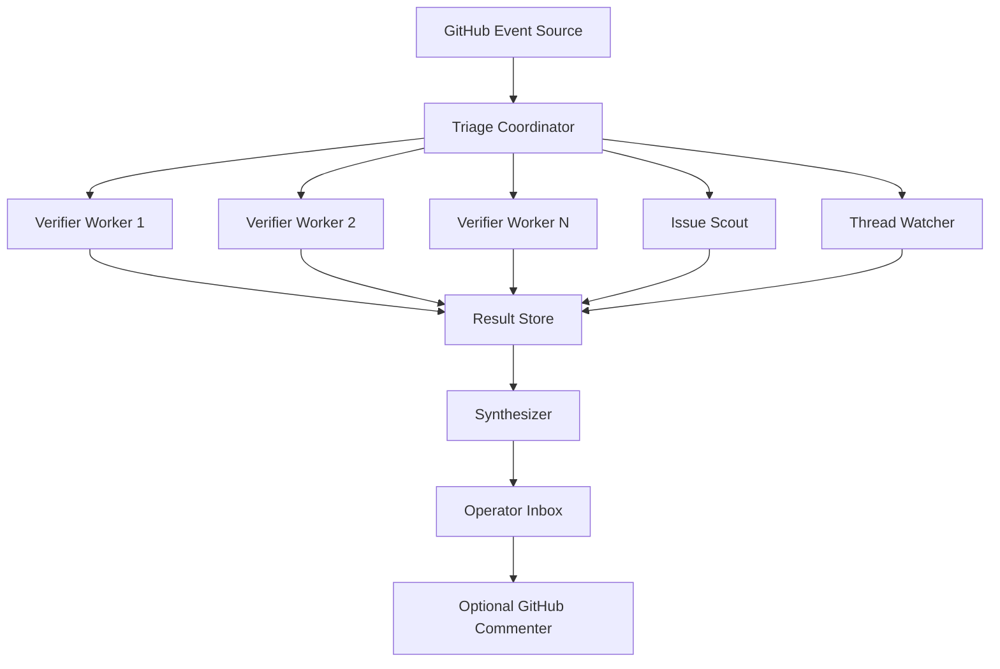

# Multi-Agent GitHub Triage Architecture

## Goal

Build an OpenClaw-powered issue triage system that can analyze many GitHub issues in parallel, verify claims against the repository, and produce maintainer-ready comments with evidence.

This is meant to support workflows like:

- scan recent low-traffic issues
- rank them by likely maintainer impact
- assign one worker per issue
- verify the code path and existing tests
- draft a concise maintainer advisory
- watch followed threads for new comments that change the diagnosis

The system should optimize for evidence quality over speed. A worker that says "not verified" with strong file references is more useful than a worker that confidently invents a root cause.

## Design Principles

- Evidence first. Every substantive claim must tie back to files, tests, logs, or issue comments.
- Narrow before broad. Prefer the smallest supported root cause and fix surface.
- Parallel by default. Independent issue investigations should run in separate sessions.
- Structured outputs. Each worker should emit machine-mergeable JSON plus an optional human summary.
- Human in the loop. The operator decides what gets posted.
- Safe by default. Workers should not mutate code or GitHub state unless explicitly allowed.

## High-Level Topology



## Core Agents

## 1. Triage Coordinator

Responsibilities:

- poll or receive GitHub issue events
- rank candidate issues by recency, traffic, and impact
- deduplicate work already in progress
- spawn verifier workers with isolated prompts and tool scopes
- collect and score results
- decide whether a thread needs follow-up

Inputs:

- recent issue metadata
- prior run history
- operator preferences

Outputs:

- worker assignments
- queue priority
- summarized triage batches

## 2. Issue Scout

Responsibilities:

- fetch recent open issues
- score likely maintainer value
- tag likely categories such as auth, routing, packaging, docs, release, runtime, UI
- detect low-value items that should use automation labels instead of manual review

Scoring dimensions:

- recency
- number of comments
- likely user impact
- blast radius
- whether the issue appears actionable
- whether the issue is probably already fixed

Output schema:

```json
{
  "issue_number": 46680,
  "priority_score": 0.88,
  "traffic_score": 0.03,
  "impact_score": 0.91,
  "recommended_action": "verify",
  "category": "runtime",
  "rationale": [
    "zero-comment issue",
    "broad model compatibility impact if true"
  ]
}
```

## 3. Verifier Worker

One verifier worker handles one issue at a time.

Responsibilities:

- read the issue body and latest comments
- trace the named code path
- inspect adjacent code paths that could explain the symptom better
- inspect existing tests
- decide whether the reported root cause is supported
- identify the smallest realistic fix seam
- draft a maintainer-ready comment

Expected behavior:

- if the issue is valid, narrow it
- if the issue is partly valid, separate symptom from blamed layer
- if the issue is unsupported, say exactly what was checked
- if the issue is already fixed on main, call that out clearly

Worker output schema:

```json
{
  "issue_number": 46680,
  "status": "partially_verified",
  "confidence": 0.84,
  "symptom_supported": true,
  "root_cause_supported": false,
  "smallest_fix_surface": [
    "src/agents/ollama-stream.ts",
    "src/agents/pi-embedded-runner/extra-params.ts"
  ],
  "files_checked": [
    "src/agents/ollama-stream.ts",
    "src/agents/ollama-stream.test.ts",
    "src/agents/pi-embedded-runner/extra-params.ts"
  ],
  "tests_checked": [
    "src/agents/ollama-stream.test.ts"
  ],
  "recommended_comment": "Current source already falls back to thinking/reasoning output..."
}
```

## 4. Thread Watcher

Responsibilities:

- revisit issues we have already analyzed
- compare new comments against the previous diagnosis
- determine whether new evidence changes the likely fix path
- flag stale or misplaced comments from us

Watch triggers:

- reporter adds a same-process repro
- maintainer asks for workaround or narrower evidence
- new logs or payloads are attached
- another commenter introduces a conflicting theory

Output:

- no-op
- follow-up suggested
- follow-up urgent

## 5. Synthesizer

Responsibilities:

- normalize output tone
- collapse overlapping verifier results
- remove unsupported speculation
- prepare a short operator digest
- optionally prepare a GitHub-ready comment body

This agent does not do first-pass code investigation. It only composes from verified artifacts.

## Optional Execution Agent

Later, if you want the system to auto-post comments, add a separate execution agent with narrow permissions:

- post approved GitHub comments
- label issues when policy says to use automation
- never infer approval from silence

Keep posting separate from verification so we can audit the exact artifact that got published.

## Shared Data Contracts

Use simple JSON records stored per issue run. Each run should have:

- issue metadata snapshot
- comment snapshot
- files checked
- tests checked
- confidence scores
- final advisory
- follow-up status

Recommended record shape:

```json
{
  "run_id": "triage-2026-03-14T22-18-11Z-46680",
  "issue_number": 46680,
  "issue_url": "https://github.com/openclaw/openclaw/issues/46680",
  "created_at": "2026-03-14T22:18:11Z",
  "agent_role": "verifier",
  "result": {
    "status": "partially_verified",
    "confidence": 0.84
  },
  "artifacts": {
    "files_checked": [],
    "tests_checked": [],
    "comment_draft": ""
  }
}
```

## Suggested OpenClaw Building Blocks

Use isolated sessions rather than one giant shared conversation.

Recommended mapping:

- one coordinator session
- one session per verifier worker
- one session for thread watching
- one session for synthesis

Useful OpenClaw primitives:

- session-based agent runs
- tool gating by role
- cron or automation for periodic polling
- filesystem-backed result snapshots
- GitHub CLI or GitHub API tools behind narrow wrappers

## Tool Permissions by Role

Coordinator:

- GitHub read access
- result-store read and write
- session spawn permissions

Scout:

- GitHub issue search
- no code mutation

Verifier:

- local repo read access
- test execution when explicitly enabled
- GitHub read access
- no GitHub write access
- no repo write access by default

Thread Watcher:

- GitHub read access
- result-store read access

Synthesizer:

- result-store read access
- no direct code or GitHub mutation required

Commenter:

- GitHub comment and labeling only
- only on approved artifacts

## Investigation Workflow

1. Scout fetches recent issues and scores them.
2. Coordinator chooses the highest-value quiet issues.
3. Coordinator spawns one verifier per issue.
4. Each verifier reads issue body, latest comments, relevant code, and tests.
5. Verifier emits a structured result and a draft comment.
6. Synthesizer merges and ranks the outputs.
7. Operator reviews and posts the best comments.
8. Thread watcher revisits commented issues and flags material updates.

## Failure Modes and Guardrails

## Hallucinated root causes

Mitigation:

- require file references for every major claim
- force workers to label unsupported ideas as hypotheses
- penalize drafts without tests or code references

## Duplicate effort

Mitigation:

- coordinator keeps a lease per issue
- thread watcher and verifier share a run registry

## Stale analysis after new comments

Mitigation:

- thread watcher compares comment timestamps
- invalidate prior diagnosis when the reporter adds a new repro artifact

## Rubber-stamping low-value issues

Mitigation:

- scout explicitly routes policy-only issues to label automation
- do not send verifier workers to requests already covered by repo policy

## Unsafe automation

Mitigation:

- separate read-only verification from write-capable posting
- require explicit operator approval before any GitHub mutation

## MVP Plan

Phase 1:

- build scout
- build verifier
- save structured results locally
- keep posting manual

Phase 2:

- add thread watcher
- add synthesizer
- add operator dashboard or digest file

Phase 3:

- add approval-gated GitHub commenter
- add evaluation metrics for verifier quality

## Success Metrics

- issues triaged per hour
- percentage of advisories with file-backed claims
- percentage of comments later confirmed useful by maintainers
- duplicate issue detection rate
- follow-up latency after new reporter evidence
- false-positive root cause rate

## Local-LLM Bias

If the OpenClaw deployment is running on a local LLM, the architecture should lean harder on deterministic tooling and less on long, subtle chain-of-thought behavior.

Recommended adaptations:

- keep worker prompts short and role-specific
- use JSON outputs instead of long prose
- persist intermediate artifacts to disk so workers can resume
- minimize context-window dependence
- prefer repo search, tests, and captured payloads as the source of truth
- let the model orchestrate and summarize, not invent evidence

## Recommended First Implementation

Start with a narrow system for exactly the workflow this design targets:

- repo: `openclaw/openclaw`
- target set: newest open GitHub issues with low comment count
- goal: produce one maintainer advisory per issue
- output: JSON artifact plus Markdown comment draft

That version is small enough to build quickly and strong enough to prove whether the architecture improves triage quality before expanding into a broader automation system.
